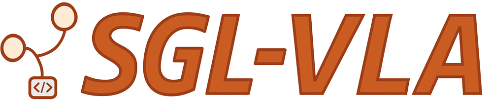

<div align="center"  id="sglangtop">
</img>

</div>

--------------------------------------------------------------------------------
This repository provides a **serving engine for OpenVLA** and other Prismatic-VLM models. Our optimized implementation based on SGLang substantially outperforms the [vanilla OpenVLA inference pipeline](https://github.com/openvla/openvla), achieving lower latency and significantly higher throughput as we scale the number of generated actions. This repository could be useful for test-time scaling, online reinforcement learning, or parallel simulation workloads.

## 📦 Environment Setup

Create and activate a conda environment:

```bash
conda create -n sglang-vla python=3.10 -y
conda activate sglang-vla
```

Install the required dependencies:

```bash
pip install -e "python[all]"
pip install timm==0.9.10
pip install json_numpy
pip install flask

# optional
sudo apt-get update
sudo apt-get install -y libnuma1 numactl
```

## Getting Started
### 🚀 Launch the Server

Start the OpenVLA inference server by running:

```bash
python openvla_server.py --seed 1
```

The server will be accessible at `http://localhost:3200`.

### 🔍 Inference Example

```python
import requests
import json_numpy as json
from PIL import Image
import numpy as np
import os

def get_batch_actions(instruction, image_path, batch_size=3, temperature=1.0):
    image_path = os.path.abspath(image_path)
    payload = {
        "instruction": instruction,
        "image_path": image_path,
        "batch_size": batch_size,
        "temperature": temperature
    }

    res = requests.post(
        "http://localhost:3200/batch",
        data=json.dumps(payload),
        headers={'Content-Type': 'application/json'}
    )
    res.raise_for_status()
    return np.array(json.loads(res.text)["output_ids"]), np.array(json.loads(res.text)["actions"])

# Example usage
instruction = "close the drawer"
image_path = "robot.jpg"

discrete_tokens, continuous_actions = get_batch_actions(
    instruction=instruction,
    image_path=image_path,
    batch_size=3,
    temperature=1.0
)

print("Discrete Action Tokens:\n", discrete_tokens)
print("Continuous Actions:\n", continuous_actions)
```

## 📖 Citation
If you find this repo useful for your research, please consider citing:
```bibtex
@article{kwok25robomonkey,
  title={RoboMonkey: Scaling Test-Time Sampling and Verification for Vision-Language-Action Models},
  author={Jacky Kwok and Christopher Agia and Rohan Sinha and Matt Foutter and Shulu Li and Ion Stoica and Azalia Mirhoseini and Marco Pavone},
  journal={arXiv preprint arXiv:2506.17811},
  year={2025},
}
```


## 📬 Contact

For questions, suggestions, or contributions, feel free to open an issue or reach out to the maintainers.
